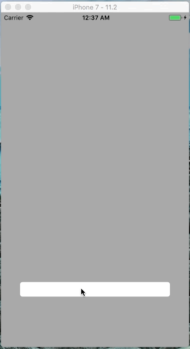

**iOS 10+**

*Simple* keyboard manager with two features:

* Active text field is always visible.
* Tapping outside of the keyboard will dismiss it.

## Preview

## Properties

    var spacing: CGFloat

## Methods

    func start()

    func stop()

## Todo

- [ ] Move to Carthage & Cocoapods
